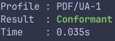

!!! info

     Check out [the dedicated page](../installation.md) for install instructions.

<br>

Validate one PDF (by default against the profile declared in its XMP metadata):

```sh
page document.pdf
```

```bash
Profile : PDF/A-1b
Result  : Conformant
Time    : 0.005s
```

If the document does not declare a profile, `page` exits with an explicit error. Use `--profile` to select a profile instead:

```sh
page document.pdf --profile 1b
```

```bash
Profile : PDF/A-1b
Result  : Non-conformant
Time    : 0.005s
```

<br>

Add `--format details` to emit details about the failure:

```sh
page document.pdf --format details
```

```sh
Profile : PDF/A-1b
Result  : Non-conformant
Time    : 0.001s

[PDFA1B-HEADER-BINARY-COMMENT-001] Conformance: [.........]
[PDFA1B-HEX-STRING-CHARACTERS-001] Conformance: [.........]
[PDFA1B-ID-SCHEMA-001] Metadata: [.........]
[PDFA1B-INFO-AUTHOR-001] Metadata: [.........]
[PDFA1B-INFO-CREATOR-001] Metadata: [.........]
[PDFA1B-INFO-KEYWORDS-001] Metadata: [.........]
[PDFA1B-INFO-PRODUCER-001] Metadata: [.........]
[PDFA1B-INFO-SUBJECT-001] Metadata: [.........]
[PDFA1B-INFO-TITLE-001] Metadata: [.........]
[PDFA1B-METADATA-STRUCTURE-001] Metadata: [.........]
[PDFA1B-TRAILER-ID-001] Conformance: [.........]
```

!!! note

      [ . . . . . . . . . ] are just placeholders of the actual messages

<br>

Or use `--format json` to emit the details as JSON:

```sh
page document.pdf --format json
```

```json
{
  "file": "document.pdf",
  "profile": "1b",
  "valid": false,
  "failures": [
    {
      "rule": "PDFA1B-TRAILER-ID-001",
      "message": "the applicable document trailer does not contain an ID entry"
    }
  ]
}
```

<br>

Write the report to a file with `--output`. A `.json` extension selects JSON automatically; use `--format details` for a detailed text report:

```sh
page document.pdf --output report.json
page document.pdf --format details --output report.txt
```

Explicit formats that conflict with `.json` or `.txt` are rejected. Other extensions, including no extension, are allowed. File output is uncolored and leaves stdout empty.

## Colors

By default, `page` uses color in the terminal output.



In order to follow the [NO_COLOR standard](https://no-color.org/), you can either set the `NO_COLOR` environment variable or pass `--no-color` to disable them:

```sh
page document.pdf --no-color
```
