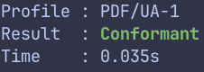

!!! info

     Check out [the dedicated page](../installation.md) for install instructions.

<br>

Validate one PDF (by default against the profile declared in its XMP metadata):

```sh
page document.pdf
```

```
Result  : Conformant
Profile : PDF/A-1b
Time    : 0.005s
```

If the document does not declare a profile, `page` exits with an explicit error. Use `--profile` to select a profile instead:

```sh
page document.pdf --profile ua1
```

```
Result  : Non-conformant
Profile : PDF/UA-1
Time    : 0.005s
```

<br>

Add `--format details` to emit details about the failure:

```sh
page document.pdf --format details
```

```
Result  : Non-conformant
Rules   : 11 failed rules / 134 total
Checks  : 24 failed checks
Profile : PDF/A-1b
Time    : 0.007s

[PDFA1B-HEADER-BINARY-COMMENT-001] Conformance: [.........]
[PDFA1B-HEX-STRING-CHARACTERS-001] Conformance: [.........]
[PDFA1B-ID-SCHEMA-001] Metadata: [.........]
[PDFA1B-INFO-AUTHOR-001] Metadata: [.........]
[PDFA1B-INFO-CREATOR-001] Metadata: [.........]
[PDFA1B-INFO-KEYWORDS-001] Metadata: [.........]
[PDFA1B-INFO-PRODUCER-001] Metadata: [.........]
[PDFA1B-INFO-SUBJECT-001] Metadata: [.........]
[PDFA1B-INFO-TITLE-001] Metadata: [.........]
[PDFA1B-METADATA-STRUCTURE-001] Metadata: [.........]
[PDFA1B-TRAILER-ID-001] Conformance: [.........]
```

!!! note

      [ . . . . . . . . . ] are just placeholders of the actual messages

<br>

Or use `--format json` to emit the details as JSON:

```sh
page document.pdf --format json
```

```json
{
  "file": "document.pdf",
  "profile": "1b",
  "compliant": false,
  "rules": {
    "total": 134,
    "passed": 132,
    "failed": 2
  },
  "checks": {
    "failed": 3
  },
  "failures": [
    {
      "rule": "PDFA1B-ICCBASED-001",
      "message": "ICCBased profile has class \"mntr\", colour space \"GRAY\", and version 4.2",
      "object_id": null,
      "category": "conformance"
    },
    {
      "rule": "PDFA1B-ID-SCHEMA-001",
      "message": "XMP does not contain the PDF/A Identification schema",
      "object_id": { "object_number": 53, "generation": 0 },
      "category": "metadata"
    }
  ]
}
```

<br>

Write the report to a file with `--output`. A `.json` extension selects JSON automatically; use `--format details` for a detailed text report:

```sh
page document.pdf --output report.json
page document.pdf --format details --output report.txt
```

Explicit formats that conflict with `.json` or `.txt` are rejected. Other extensions, including no extension, are allowed. File output is uncolored and leaves stdout empty.

## Exit codes

The `page` exit codes are a stable CLI contract:

| Code | Meaning |
| ---: | --- |
| `0` | Validation completed with no failed checks, or `--help` / `--version` was requested. |
| `1` | Operational failure, including I/O or safety-limit errors, missing or invalid profile declarations, output errors, and invalid CLI arguments. |
| `2` | The PDF is non-compliant, or the PDF parser could not parse the document. |

CLI usage errors such as an invalid `--profile` value use code `1`, so they remain distinct from validation failures and PDF parser errors.

## Safety limits

The CLI exposes every `SafetyLimits` bound. Defaults are suitable for most documents and can be overridden per invocation:

```sh
page document.pdf --max-table-span 256 --max-table-grid-cells 250000
```

| Option                             |   Default | Purpose                                                                             |
| ---------------------------------- | --------: | ----------------------------------------------------------------------------------- |
| `--max-input-size`                 |   256 MiB | Maximum input file size.                                                            |
| `--max-decoded-stream-size`        |    32 MiB | Maximum decoded size of one stream.                                                 |
| `--max-total-decoded-content-size` |   256 MiB | Maximum combined decoded content and retained font-stream data.                     |
| `--max-form-invocations`           |    10,000 | Maximum Form XObject expansions across one document.                                |
| `--max-object-count`               | 1,000,000 | Maximum number of parsed indirect objects.                                          |
| `--max-reference-depth`            |       256 | Maximum reference-chain depth.                                                      |
| `--max-xref-revisions`             |     1,024 | Maximum number of incremental-update revisions read from the cross-reference chain. |
| `--max-table-span`                 |     1,024 | Maximum number of rows or columns covered by one table cell.                        |
| `--max-table-grid-rows`            |     1,024 | Maximum number of rows represented in an inspected table grid.                      |
| `--max-table-grid-columns`         |     1,024 | Maximum number of columns represented in an inspected table grid.                   |
| `--max-table-grid-cells`           | 1,000,000 | Maximum number of cells represented in an inspected table grid.                     |
| `--max-unicode-cmap-mappings`      | 1,000,000 | Maximum number of mappings expanded from one ToUnicode CMap.                        |

For trusted files, disable all configurable limits with `page document.pdf --disable-safety-limits`. The flag conflicts with any explicitly supplied `--max-*` option. Validation may consume unrestricted memory and CPU; see the [safety limits guide](../guide/safety-limits.md) for details.

## Colors

By default, `page` uses color in the terminal output.



In order to follow the [NO_COLOR standard](https://no-color.org/), you can either set the `NO_COLOR` environment variable to 1 or pass `--color never` to disable them. Other options are `--color auto` (default) and `--color always`.
