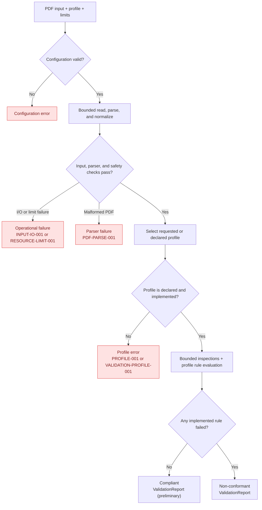

This page describes how `page` works under the hood.

```mermaid
%%{init: {"themeVariables": {"fontSize": "18px"}}}%%
flowchart TD
    A["PDF input + profile + limits"] --> B{"Configuration valid?"}
    B -- "No" --> E1["Configuration error"]
    B -- "Yes" --> C["Bounded read, parse, and normalize"]
    C --> D{"Input, parser, and safety checks pass?"}
    D -- "I/O or limit failure" --> E2["Operational failure\nINPUT-IO-001 or RESOURCE-LIMIT-001"]
    D -- "Malformed PDF" --> E3["Parser failure\nPDF-PARSE-001"]
    D -- "Yes" --> F["Select requested or declared profile"]
    F --> G{"Profile is declared and implemented?"}
    G -- "No" --> E4["Profile error\nPROFILE-001 or VALIDATION-PROFILE-001"]
    G -- "Yes" --> H["Bounded inspections + profile rule evaluation"]
    H --> I{"Any implemented rule failed?"}
    I -- "No" --> J["Compliant\nValidationReport (preliminary)"]
    I -- "Yes" --> K["Non-conformant\nValidationReport"]

    classDef error fill:#fee2e2,stroke:#dc2626,color:#7f1d1d;
    class E1,E2,E3,E4 error;
```
