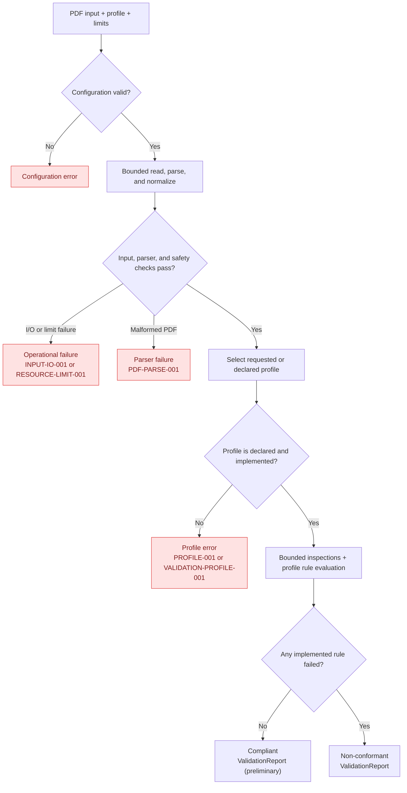

This page describes how `page` works under the hood.

The parts that take the more time/ressources are:

- parsing the PDF, which is done via [`lopdf`](https://github.com/J-F-Liu/lopdf)
- bounded inspections + profile rule evaluation

Once the profile that needs to be validated is defined (without an explicit input, it uses the one defined in the XMP metadata of the document), we figure out which rules need to be checked for the document and step by step construct the `ValidationReport` output.

But when user do **not** request _which_ rule failed (using `is_pdf_compliant_*()` functions or using the CLI without `--format`), `page` will stop at the very first failed rule it can find. The main point of this is to avoid spending time checking each rule for non-conformant documents when we're only interested in whether the document complies with the profile. You can see in the [benchmark page](../benchmark.md) that this often leads to 2 to 5x faster results.

## AI coding

`page` repo contains an `AGENTS.md` file for instructions for AI agents. If you use Claude Code, feel free to add a `CLAUDE.md` file and use a symlink to match `AGENTS.md`.
