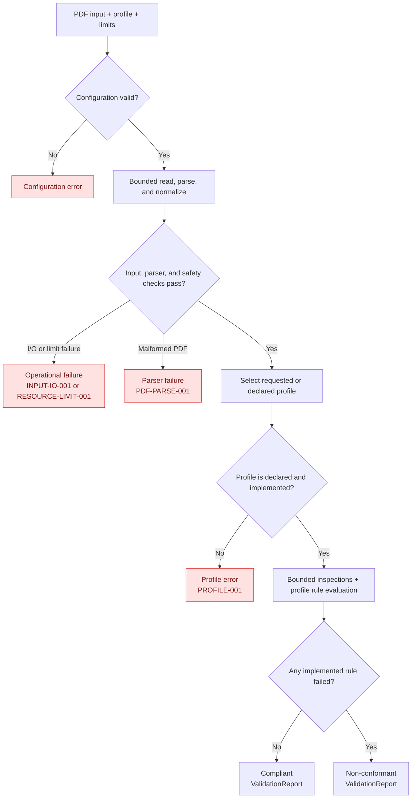

This page describes how `page` works under the hood.

```mermaid
%%{init: {"themeVariables": {"fontSize": "18px"}}}%%
flowchart TD
    A["PDF input + profile + limits"] --> B{"Configuration valid?"}
    B -- "No" --> E1["Configuration error"]
    B -- "Yes" --> C["Bounded read, parse, and normalize"]
    C --> D{"Input, parser, and safety checks pass?"}
    D -- "I/O or limit failure" --> E2["Operational failure\nINPUT-IO-001 or RESOURCE-LIMIT-001"]
    D -- "Malformed PDF" --> E3["Parser failure\nPDF-PARSE-001"]
    D -- "Yes" --> F["Select requested or declared profile"]
    F --> G{"Profile is declared and implemented?"}
    G -- "No" --> E4["Profile error\nPROFILE-001"]
    G -- "Yes" --> H["Bounded inspections + profile rule evaluation"]
    H --> I{"Any implemented rule failed?"}
    I -- "No" --> J["Compliant\nValidationReport"]
    I -- "Yes" --> K["Non-conformant\nValidationReport"]

    classDef error fill:#fee2e2,stroke:#dc2626,color:#7f1d1d;
    class E1,E2,E3,E4 error;
```

The parts that take the most time and resources are:

- parsing the PDF, which is done via [`lopdf`](https://github.com/J-F-Liu/lopdf)
- bounded inspections + profile rule evaluation

Once the profile to validate is defined (if no profile is explicitly provided, `page` uses the one defined in the document's XMP metadata), we determine which rules need to be checked for the document and construct the `ValidationReport` output step by step.

But when users do **not** request _which_ rule failed (by using the `is_pdf_compliant_*()` functions or the CLI without `--format`), `page` uses **lazy** validation: it stops at the very first failed rule it finds. The main point is to avoid spending time checking each rule for non-conformant documents when we're only interested in whether the document complies with the profile.

## AI coding

The `page` repository contains an `AGENTS.md` file with instructions for AI agents. If you contribute to `page`, you're expected to be accountable for the changes you make.
